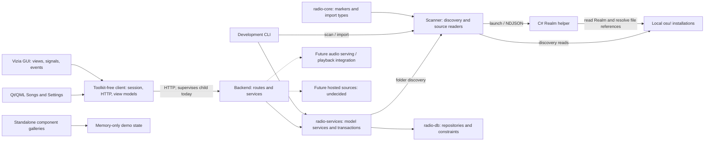

# Agent guide index

This is the source-grounded technical map shared by Codex and Claude. Start at
[AGENTS.md](../../AGENTS.md) for constraints and task routing. Technical facts
below describe the inspected repository; product direction comes from the user's
confirmed intentions. Neither source inspection nor a passing build implies
successful playback or validation on every target platform.

## Reading order

1. Read the shared entry point and this page when entering the project.
2. Read only the relevant component guide: [scanner](scanner.md),
   [frontend](frontend.md), [database](database.md), or [backend](backend.md). Follow its source/test links
   before editing an affected behavior.
3. Use [development](development.md) for environment requirements, scoped
   commands, verification selection, troubleshooting, and upstream documentation.
4. For GUI or scanner implementation work, follow the linked
   [GUI](../../.agents/skills/osu-radio-gui/SKILL.md) or
   [scanner](../../.agents/skills/osu-radio-scanner/SKILL.md) procedure. For a
   findings-only pre-commit review, use [cr](../../.agents/skills/cr/SKILL.md).
   Claude follows the same files through [CLAUDE.md](../../CLAUDE.md).

## Component map

The [workspace manifest](../../Cargo.toml) lists the Rust 2024 packages and shared
Tokio runtime dependency. The helper is a separate .NET project.

| Component | Responsibility and source entry | Change here when |
| --- | --- | --- |
| `radio-core` | [Source markers](../../crates/radio-core/src/lib.rs) and [import types](../../crates/radio-core/src/import_types.rs) | Changing source-neutral data without I/O or persistence. |
| `radio-scanner` | [Reader dispatch](../../crates/radio-scanner/src/lib.rs), [discovery](../../crates/radio-scanner/src/discovery/mod.rs), [lazer reader](../../crates/radio-scanner/src/lazer/scanner.rs) | Changing discovery or transforming a source into domain output. |
| Realm helper | [.NET producer](../../tools/osu-lazer-realm-parser/Program.cs) | Changing Realm extraction or its NDJSON protocol. Coordinate with parser/domain types. |
| `osu-radio-cli` | [Commands](../../apps/osu-radio-cli/src/commands/mod.rs), [arguments](../../apps/osu-radio-cli/src/types.rs) | Changing development-harness argument/output wiring. Keep reusable behavior in crates. |
| `osu-radio-server` | [Startup](../../apps/osu-radio-server/src/main.rs), [routes](../../apps/osu-radio-server/src/routes/mod.rs) | Changing backend orchestration, HTTP translation or hosting. See the database and backend contracts. |
| `radio-services` | [Shared handle and model services](../../crates/radio-services/src/lib.rs) | Persisted-model access and transactional workflows for server and CLI. |
| `radio-db` | [Package boundary](../../crates/radio-db/Cargo.toml) | [Repositories, SQL and persistence constraints](database.md). |
| `osu-radio-client` | [Public facade](../../crates/osu-radio-client/src/lib.rs), [session](../../crates/osu-radio-client/src/session.rs), [view models](../../crates/osu-radio-client/src/view_models/track.rs) | Changing reusable frontend communication, supervision or toolkit-free UI data. |
| `osu-radio-gui-vizia` | [App state/events](../../apps/osu-radio-gui-vizia/src/app.rs), [view shell](../../apps/osu-radio-gui-vizia/src/views/mod.rs), [assets](../../apps/osu-radio-gui-vizia/src/assets.rs) | Changing desktop presentation and interactions. |
| `osu-radio-qt` | [Rust launch/adapter](../../apps/osu-radio-qt/src/main.rs), [QML views](../../apps/osu-radio-qt/qml/Songs.qml) | Live Qt Songs/Settings and standalone component gallery; shares the client application controller with Vizia. |

## Architecture

Solid arrows show current calls, data flow, or dependency boundaries. Dashed
arrows show intended future capabilities; they are not implemented paths.

Persistence workflows are described in [database](database.md). The backend boundary owns
OS access, source reading, persistence and eventual audio serving; reusable
scanner/domain pieces also support the development CLI. The frontend talks
through the toolkit-free client. A replacement toolkit or hosting mechanism must
preserve these responsibilities without inheriting Vizia or subprocess hosting
as a permanent platform requirement.

## Capability status

“Implemented” means confirmed in source, not newly exercised on all platforms.
Tests and their limits are linked in the component guides.

| Capability | Status | Evidence / boundary |
| --- | --- | --- |
| Stable and lazer installation discovery | Implemented | [Scanner tiers/options](scanner.md); scoped roots, filters, limits, relocation and cancellation limitations. |
| Lazer metadata import through Realm | Implemented | [Scanner/helper protocol](scanner.md); output is materialized, source audio is referenced. Real-library compatibility is separate from fake-helper tests. |
| Stable metadata import | Unsupported today | [Dispatch](../../crates/radio-scanner/src/lib.rs) returns `UnsupportedSourceError`. No delivery decision is implied. |
| Local audio file resolution | Implemented as references | [Helper](../../tools/osu-lazer-realm-parser/Program.cs); resolving a path is not playback or serving audio. |
| Client session, child supervision, HTTP wrappers | Implemented | [Frontend](frontend.md), [backend](backend.md); readiness output is a protocol, see backend API contracts. |
| Optional OpenAPI/Scalar build | Implemented | [Backend](backend.md); both documentation feature states need verification. |
| Songs/settings tabs, library selection, window actions | Implemented UI bindings | [Frontend interaction table](frontend.md#implemented-interactions-and-placeholders). Source binding is not cross-platform interaction validation. |
| Search inputs | Partial | Text/query state and separate placeholders work in source; no filtering is wired. |
| Library and folder settings | Implemented | [Frontend](frontend.md); server rows, bounded artwork loading, optional durations, folder dropdown and native chooser registration. Selection is presentation only. |
| Transport, seeking, volume, output-device settings | Placeholder | [Frontend](frontend.md); visual controls, no playback engine or device selection wired. |
| Qt Songs, Settings and component gallery | Connected client; offline gallery | [Qt frontend](frontend.md#qt-frontend); shared session/controller, library/media and folder registration; no playback. |
| End-to-end local music playback | Product goal | Not implemented by selecting a track. |
| Hosted sources | Future direction | Provider, protocol and hosting remain undecided. |
| Database repositories and complete snapshot replacement | Implemented | [Database](database.md); SQLite default, PostgreSQL alternative, explicit reset for legacy databases. |

## Confirmed direction and deferred decisions

The product is a desktop music player for local osu! installations, eventually
also using hosted sources. Linux and Windows are current platforms. macOS is
unverified; Android and iOS are future goals. Platform-specific branches in
discovery do not establish that a complete app has been validated there.

Preserve source-neutral domain types, backend ownership of OS/source access,
a toolkit-free client, and a GUI concerned with presentation and events. Neither
the current Vizia choice nor a server subprocess constrains the future platform
implementation. Hosted sources must not be ruled out by assuming every user
needs a local installation.

The shared services coordinate concrete repositories, installation-owned
snapshots and shared immutable metadata. Read [database](database.md),
[backend](backend.md) and the [API skill](../../.agents/skills/osu-radio-api/SKILL.md)
for those contracts. Hosting, providers, mobile implementation and playback
implementation remain open.

## Evidence and maintenance

Follow [the maintenance policy](../../AGENTS.md#maintain-the-guidance): update
affected facts with behavior changes, preserving the distinction between current
source, placeholders, user-confirmed intent and open decisions. Check links and
commands against the checkout; keep actual task validation separate from
recommended checks. Read-only source inspection was the basis for this guide,
not a database migration, real import or playback test.
